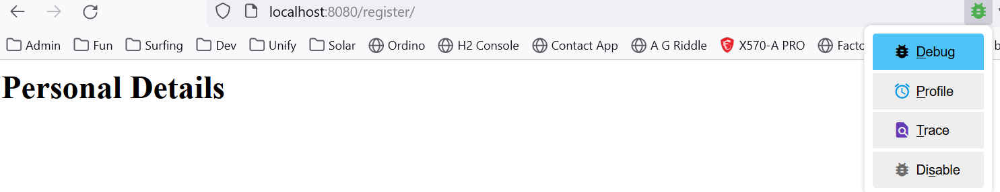
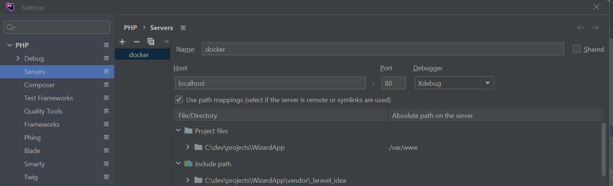
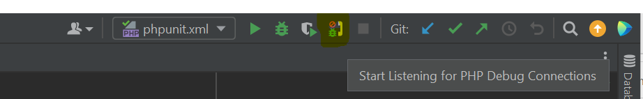
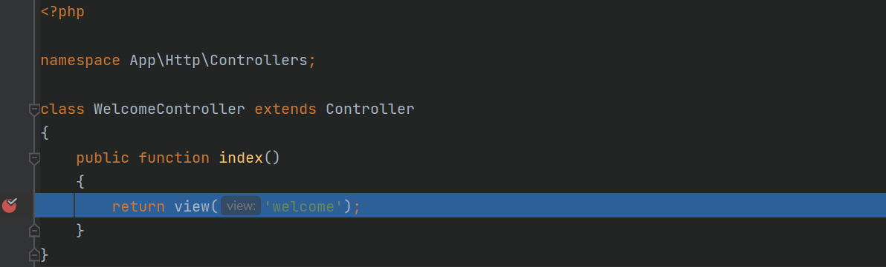
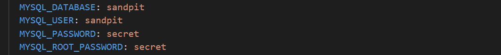
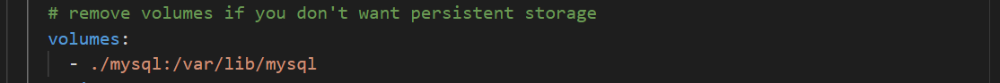
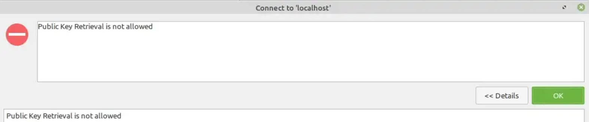
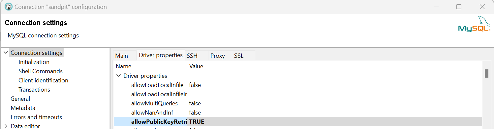

# Laravel-MySQL-Docker README

This project contains the required files to run Laravel 9.x in Docker with PHP 8.2, debugging and persistent storage for MySQL 8. The below setup has been tested on **Windows 11** and Docker (running in WSL 2 mode - the default). Everything will just work by following the **How to** section below, but for completeness sake additional instructions are provided that might form part of a normal developers workday.

**Notes:** 
1. Debugging sessions take about 3/4 seconds to connect, but once connected, stepping through the code is super fast.
2. I did not create special WSL container(s) - just the normal Docker installation is perfectly fine. Just ensure the docker bin directory in on your path in order to run the Docker command in the **How to** below. The default is:

 		C:\Program Files\Docker\Docker\resources\bin

3. Seperate repos for Maria DB and Postgres to be added soon.
4. Redis support to be added soon.
5. Lastly, I might add launch file configuration for VSCode

## How to

1. **Only** copy the **docker** folder into the root (top level) of an existing Laravel 9.x project
2. Staying in the root directory run the docker compose command, changing **-p <project-name>** below to the name you would like to use.

For example from:

`docker compose -p <project-name> -f "docker\docker-compose.yml" up -d --build`

To:

`docker compose -p my-amazing-app -f "docker\docker-compose.yml" up -d --build`

## Debugging
Save yourself a lot of time and just install XDebug Helper extension on your browser (I tested it with Firefox, Chrome and Edge) - all good. In you browser settings, just ensure that the icon is available on the toolbar to make life easy. Then enable debugging in the browser and your Breakpoints will hit the mark.

## PhpStorm notes

By default, PhpStorm tries to listen on port 9000, then 9003 for xdebug requests.
However, nginx/php-fpm already uses port 9000 and you will get an error.

In **Settings > PHP > Debug**

Ensure that debug port is set to only 9003

In addition, and since this will be remote debugging, you need to ensure that the you setup the correct path for debugging to work across the board.

In **Settings > PHP > Servers**

Ensure that you enable **Use path mappings** and add **/var/www** for **Project files**

**Note:** I called this server setup "docker", since I also have a 100% local setup... which is not shown in the image above for simplicity...

Then to start listening to debugging requests just hit the little "phone" icon:

And it will fire:

## MySQL

Modify in **docker-compose.yml** to the database and credentials you would like to use. Remember to also update your Laravel configuration (.env file) accordingly.

To remove persistent storage remove the lines in **docker-compose.yml**:

Against commaon recommendation, the configuration allows remote connections from any host.

This just makes development easier. Feel free to disable this by removing this line in docker-compose.yml:

`MYSQL_ROOT_HOST: '%'`

## DBeaver
When trying to connect to the MySQL using DBeaver on your local machine, you might get an error that public key retrieval is not allowed

Just change the **Driver properties** (2nd Tab on Edit connection r-click menu) to allow it

## Git Notes

Since we are using persistent storage it would be best to add the following line to your .gitignore

`/docker/mysql/*`

## Optional - Modify files

1. To change xdebug config, modify **Dockerfile** - (not recommended)
